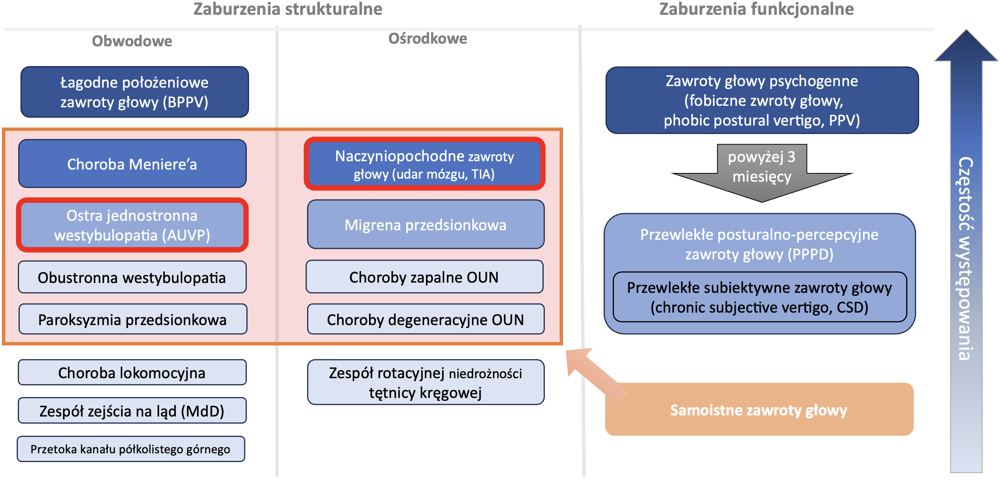
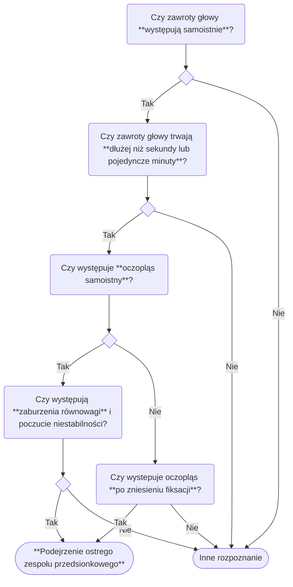
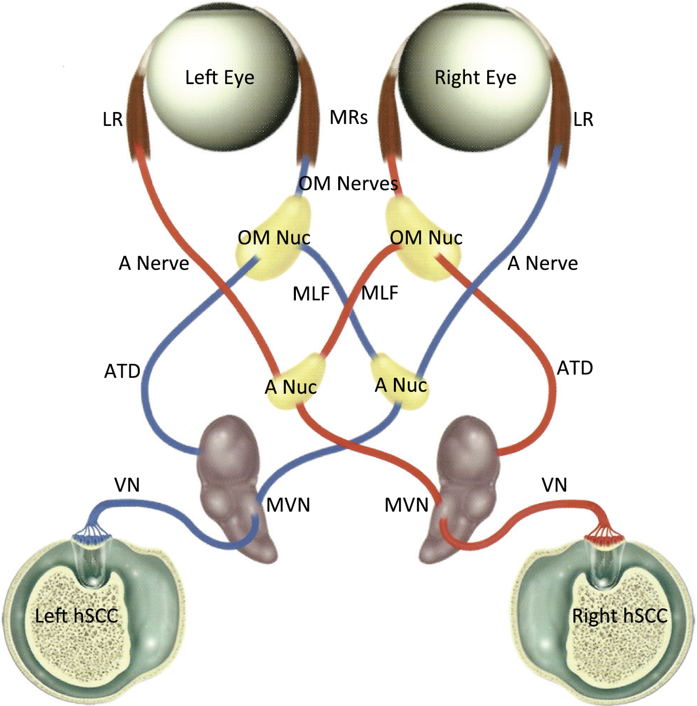

# Samoistne zawroty głowy
### Sebastian Bojanowski
#### Klinika Neurologii WLS WUM, Szpital Bielański w Warszawie

---

# Spektrum zespołów przedsionkowych

<Footnotes x="l">
    <Footnote>Opracowanie własne na podstawie International Classification of Vestibular Disorders, Journal of Vestibular Research (http://jvr-web.org//icvd), 10.09.2024</Footnote>
</Footnotes>

---
layout: two-cols
---

# Cechy ostrego zespołu przedsionkowego
- ==**samoistne (spontaniczne) wystąpienie objawów**==
- **silne zawroty głowy różnego typu**
    - uczucie wirowania otoczenia (ang. *vertigo*)
    - uczucie niestabilności podłoa (ang. *dizziness*)
- ==**obecność oczopląsu samoistnego**==,
- **czas trwania**
    -  poniżej 24 godzin (zwykle < 60 minut),
        - przemijający napad niedokrwienia mózgu,
    - co najmniej 24 godziny, 
        - udar niedokrwienny mózgu.
        - ostra jednostronna westybolopatia (AUVP),
- występowanie **zaburzeń równowagi** oraz poczucia niestabilności,

::right::

---
layout: two-cols
---

# Odruch przedsionkowo-oczny (*Vestibulo-ocular reflex, VOR*)

- **kompensacyjny zwrot  gałek ocznych w stronę przeciwną do kierunku ruchu głowy**, 
    - w celu zachowania fiksacji wzroku na określonym obiekcie,
- stabilizuje obraz na siatkówce podczas dowolnych ruchów głowy,
- bardzo szybki odruch, trwający 10-12 msek,
- szybkość ruchu gałek ocznych **proporcjonalna** do prędkości ruchu głowy,
- kierunek ruchu gałek ocznych jest **przeciwny** do kierunku ruchu głowy.
::right::

---

# Oczopląs samoistny
- występuje przy spojrzeniu na wprost (w centralnym ustawieniu gałek ocznych),
- przy podniesionej głowie, w naturalnym położeniu (bez skrętu czy pochylenia głowy),
- nie jest prowokowany pozycją głowy ani manewrami diagnostycznymi czy terapeutycznymi,
- „Stopnie” oczopląsu samoistnego
    - I stopień – oczopląs obecny jedynie przy patrzeniu w kierunku fazy szybkiej,
        - przy zastrzeżeniu, że nie spełnia w pełni definicji oczopląsu samoistnego, ponieważ nie występuje przy spojrzeniu na wprost,
    - II stopień – oczopląs obecny również przy spojrzeniu na wprost,
    - III stopień – oczopląs obecny również przy spojrzeniu w kierunku fazy wolnej.

---

# **Obwodowy** oczopląs samoistny
- **obuoczny**
- ==**jednokierunkowy**==, niezależnie od kierunku spojrzenia,
- ==**nasila się przy spojrzeniu w kierunku fazy szybkiej**== (prawo Alexandra),
- **przeważnie ==poziomy lub poziomo-obrotowy==**, w kierunku przeciwnym do strony uszkodzenia,
    - ***oczopląs poziomo-obrotowy*** występuje w jednostronnym uszkodzeniu całego błędnika (w zakresie wszystkich kanałów półkolistych i ich unerwienia),
    - ***oczopląs poziomy*** (z dyskretną komponentą obrotową) występuje w jednostronnym uszkodzeniu w obrębie kanału półkolistego bocznego i jego unerwienia,
    - ***oczopląs pionowo-obrotowy*** występuje w jednostronnym uszkodzeniu w obrębie kanału półkolistego przedniego lub tylnego i ich unerwienia 
- ==**wygasza się przy fiksacji wzroku**==,
- wzmacnia się przy zniesieniu fiksacji,
- stała prędkość fazy wolnej.

<Footnotes x="l">
    <Footnote>Eggers, S. D. Z., et al. (2019). "Classification of vestibular signs and examination techniques: Nystagmus and nystagmus-like movements.” J Vestib Res 29(2-3): 57-87.</Footnote>
</Footnotes>

---

# **Ośrodkowy** oczopląs samoistny
- ==**zmiennokierunkowy**==
- **najczęściej ==ośrodkowy oczopląs pionowy lub obrotowy==**  (często jednego rodzaju – tylko pionowy lub tylko obrotowy),
    - z dominującym ruchem gałek ocznych w dół (*downbeat nystagmus*), 
    - z dominującym ruchem gałek ocznych w górę (*upbeat nystagmus*),
    - z dominującym ruchem obrotowym gałek ocznych (*torsinal nystagmus*),
- **ośrodkowy oczopląs poziomy**,
    - ośrodkowy oczopląs poziomy jednokierunkowy,
        - głównie poziomy lub mieszany poziomo-obrotowy,
        - decydujące są inne elementy oceny klinicznej (np. ogniskowe objawy neurologiczne),
    - oczopląs utajony,
        - oczopląs ujawniający się przy zasłonięciu jednego oka a nieobecny przy patrzeniu obuocznym,
        - kierunek oczopląsu w stronę zasłoniętego oka.
<Footnotes x="l">
    <Footnote>Eggers, S. D. Z., et al. (2019). "Classification of vestibular signs and examination techniques: Nystagmus and nystagmus-like movements.” J Vestib Res 29(2-3): 57-87.</Footnote>
</Footnotes>

---

# Oczopląs spojrzeniowy (*gaze evoked nystagmus*)
- zmiennokierunkowy oczopląs wywołany spojrzeniem lub wpatrywaniem się
- poziomy lub pionowy,
- objaw uszkodzenia integracji neuronalnej na poziomie pnia mózgu i móżdżku.

---

# Skośne zbaczanie gałek ocznych (*skew deviation*)
- niewspółosiowe ustawienie gałek ocznych
    - spowodowane niesymetryczną impulsacją układu przedsionkowego do układu odpowiedzialnego za ruchomość gałek ocznych,

---

# Test pchnięca głową (*head impulse test, HIT test*)
- ==**służy do oceny odruchu przedsionkowo-ocznego**== (ang. *vestibulo-ocular reflex, VOR*),
- wykonanie testu:
    - pacjent siedzi na przeciwko osoby badającej i ma za zadanie fiksować wzrok na nosie badającego,
    - badający trzyma początkowo głowę pacjenta w linii pośrodkowej,
    - badający obraca głowę pacjenta gwałtownym ruchem o ok. 20 stopni w jedną, a następnie w druga stronę,
- **prawidłowy wynik HIT**:
    - chory ==*jest w stanie utrzymać wzrok*== na nosie badającego, pomimo ruchów głowy 
    - świadczy o zachowanym prawidłowym VOR,
    - charakterystyczny dla uszkodzenia pochodzenia ośrodkowego,
- **nieprawidłowy wynik HIT**
    - chory ==***nie** jest w stanie utrzymać wzroku*== na nosie badającego 
    - obecność ==**korygujących sakkad**== fiksujących ponownie wzrok świadczy o nieprawidłowym VOR
    - charakterystyczny dla zaburzeń pochodzenia obwodowego,

---

# Test naprzemiennego zasłaniania oczu
- pacjent patrzy na badającego,
- badający zakrywa jedno oko chorego,
- następnie szybko odkrywa oko i zasłania drugie oko,
- następnie badający ponownie zakrywa pierwsze oko. 
- **pojawienie się pionowego ruchu gałek ocznych wskazuje na ich zbaczanie skośne**

---

# **Ośrodkowy** ostry zespół przedsionkowy
- **==charakterystyczny układ objawów w teście HINTS==**
    - **prawidłowy wynik testu pchnięcia głowy  (HIT test)**,
    - **charakterystyczny obraz kliniczny oczopląsu**,
    - **obecność zbaczania skośnego gałek ocznych (*skew deviation*)**,
- **==oczopląs samoistny zmiennokierunkowy==**, 
    -  **oczopląs czysto obrotowy lub czysto pionowy**
    - przy uszkodzenia w zakresie unaczynienia tętnicy przedniej dolnej móżdżku (AICA) oczopląs może być poziomy i naśladować przyczynę obwodową.
- **==oczopląs spojrzeniowy==**,
- **==ciężkie zaburzenia równowagi== i niestabilność postawy**
    - charakterystyczne dla zawrotów głowy pochodzenia ośrodkowego
- **==obecność ogniskowych objawów neurologicznych==**
    - głównie objawy z pnia mózgu i móżdżku,
- **objawy ogniskowego uszkodzenia mózgu uwidoczniono w badaniu rezonansu magnetycznego mózgu**, w sekwencji DWI (*diffusion weighted images*)

---

# **Obwodowy** ostry zespół przedsionkowy
- **==charakterystyczny układ objawów w teście HINTS==**
    - **nieprawidłowy prawidłowy wynik testu pchnięcia głowy (HIT test)**,
    - **charakterystyczny obraz kliniczny oczopląsu**,
    - **brak zbaczania skośnego gałek ocznych (skew deviation)**,
- **==oczopląs samoistny jednokierunkowy==**, 
- **oczopląs poziomy, poziomo-obrotowy lub pionowo-obrotowy**
    - oczopląs powinien nasilać się przy patrzeniu w stronę fazy szybkiej (*prawo Alexandra*),
    - oczopląs wyciszający się przy fiksacji wzroku,
- **występowanie zawrotów głowy w spoczynku, nasilających się w czasie dowolnych ruchów głowy** 
- brak klinicznych i radiologicznych cech ogniskowego uszkodzenia OUN
